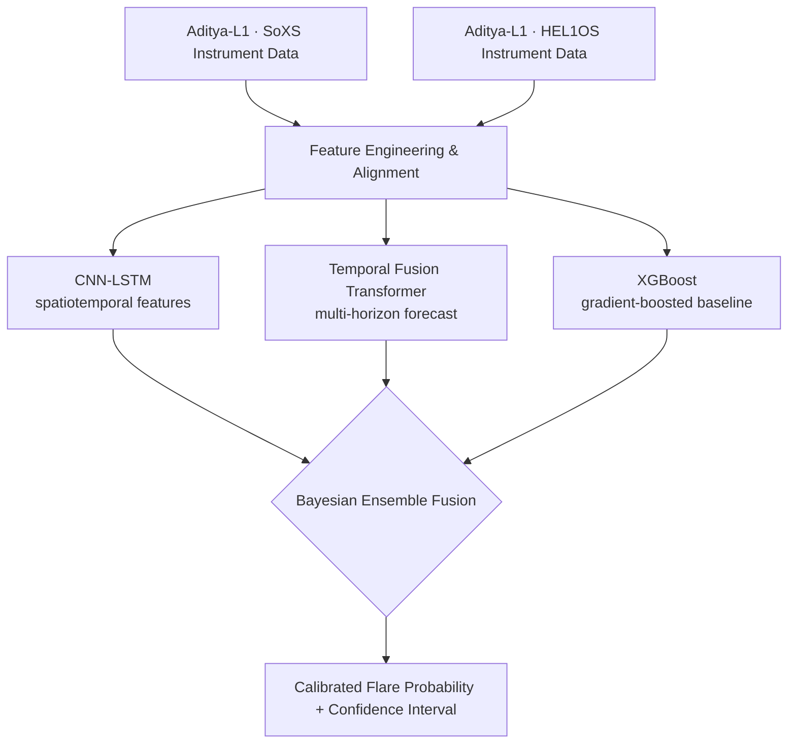
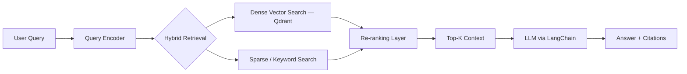
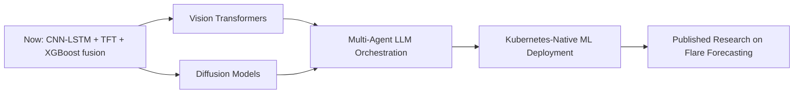

<div align="center">


<br/>

<p align="center">
  
  
  
  
</p>

<a href="https://skyline.github.com/YOUR_USERNAME/2026">
  
</a>


</div>

<br/>

## 📑 Table of Contents

- [About Me](#-about-me)
- [Career & Academic Timeline](#-career--academic-timeline)
- [Experience](#-experience)
- [Tech Stack](#-tech-stack)
- [Flagship Project — Solar Flare Forecasting](#️-flagship-project--solar-flare-forecasting-on-aditya-l1-data)
- [Project Deep-Dives](#-project-deep-dives)
- [GitHub Stats](#-github-stats)
- [Education](#-education)
- [Certifications](#-certifications)
- [Skill Proficiency](#-skill-proficiency)
- [Coding Profiles](#️-coding-profiles)
- [AI Roadmap](#-ai-roadmap-2026)
- [Research Interests](#-research-interests)
- [Achievements & Fun Facts](#-achievements--fun-facts)
- [Live Feeds](#-live-feeds)
- [Interests & Extracurriculars](#-interests--extracurriculars)
- [Languages Known](#-languages-known)
- [2026 Goals](#-2026-goals)
- [A Note on What's Real Here](#-a-note-on-whats-real-here)


## ⚡ About Me


name: Sameer Yaseen A S
title: AI/ML Engineer
location: Chennai, India (OMR corridor)
email: sameerfayaz1028@gmail.com

education:
  degree_1: B.E. Computer Science & Engineering — Rajalakshmi Institute of Technology (CGPA 8.81/10)
  degree_2: B.S. Data Science & Applications — IIT Madras (Year 2, In Progress)

headline_metrics:
  - 98% classification accuracy on a CNN-based lung cancer detection model
  - Sub-100ms inference latency on a real-time predictive maintenance pipeline
  - 30% reduction in manual reporting workflows at Deloitte USI

core_focus:
  - Deep Learning: CNN-LSTM, Temporal Fusion Transformers, Bayesian ensembles
  - Computer Vision: real-time, edge-deployable inference pipelines
  - Retrieval-Augmented Generation: hybrid retrieval + re-ranking with LangChain & Qdrant
  - MLOps: feature stores, drift detection, canary deployment, infrastructure as code

flagship_project: >
  Solar flare forecasting/nowcasting system built on ISRO Aditya-L1
  spacecraft data (SoXS + HEL1OS instruments) — CNN-LSTM + Temporal Fusion
  Transformer + XGBoost fused through a Bayesian ensemble layer.

engineering_style: >
  Ship it, break it, document the bugs, fix them properly, remove
  anything fabricated — the README should reflect what the code actually does.

open_to: [ML Engineer, Data Scientist, AI/ML Research]


<br clear="right"/>


## 🗓 Career & Academic Timeline


timeline
    title Sameer's AI/ML Journey
    2023 : B.E. CSE begins — Rajalakshmi Institute of Technology
         : B.S. Data Science begins — IIT Madras
    2024 : Computer Vision Research Lead — RIT (real-time player tracking, ~95% accuracy @ 30 FPS)
    2025 : Feb — E-Commerce Recommendation Engine (collaborative filtering, ~25% relevance lift)
         : Aug — Data Analytics Intern, Deloitte USI (50K+ records automated, ~30% time saved)
         : Sep — Lung Cancer Detection CNN (98% accuracy, outperformed VGG16 / ResNet50)
         : Sep–Nov — AI/ML Engineer & Data Scientist Intern, CSIR-CEERI (real-time drowsiness detection)
         : Dec — Legal RAG System (LangChain + Qdrant, hybrid retrieval + re-ranking)
    2026 : May — Predictive Maintenance System (LSTM-VAE + XGBoost, sub-100ms fault detection)
         : Ongoing — Solar Flare Forecasting on ISRO Aditya-L1 data


## 💼 Experience

<table>
<tr>
<td width="100%">

**🔬 AI/ML Engineer & Data Scientist Intern** — *CSIR-CEERI* &nbsp;|&nbsp; Sep 2025 – Nov 2025

Engineered a real-time drowsiness detection system, applying hyperparameter tuning on a 5,000+ sample annotated dataset with OpenCV and CNN.

- 🎯 **+15% accuracy gain** over the baseline model
- 🎯 **−20% false positives** after tuning
- This work underpins the **Aegis-Wake** project below (MediaPipe Face Mesh, EAR/MAR, PERCLOS)

</td>
</tr>
<tr>
<td width="100%">

**📊 Data Analytics Intern (Virtual)** — *Deloitte USI, via Forage* &nbsp;|&nbsp; Aug 2025

Automated reporting workflows for 50,000+ records using Python (Pandas), Power BI, and Excel.

- 🎯 **~30% reduction** in manual reporting time
- 🎯 Delivered executive-ready dashboards

</td>
</tr>
<tr>
<td width="100%">

**🎥 Computer Vision Research Lead** — *Rajalakshmi Institute of Technology* &nbsp;|&nbsp; Jul 2024 – Apr 2025

Led a 3-member team to architect and deploy a real-time player tracking system using OpenCV and Flask.

- 🎯 **~95% detection accuracy at 30 FPS**
- 🎯 Automated positional tagging, cutting coach review time

</td>
</tr>
</table>


## 💻 Tech Stack

**Programming Languages**

<p align="left">


</p>

**ML & Deep Learning**

<p align="left">


</p>

**Data & Analytics**

<p align="left">


</p>

**Frameworks & APIs**

<p align="left">


</p>

**Databases**

<p align="left">


</p>

**Cloud & DevOps**

<p align="left">


</p>


## 🛰️ Flagship Project — Solar Flare Forecasting on Aditya-L1 Data


A research-grade nowcasting pipeline for solar flare events, built directly on instrument telemetry from ISRO's Aditya-L1 spacecraft.



- **Data sources:** SoXS (Solar X-ray Spectrometer) and HEL1OS instrument telemetry
- **Modeling stack:** CNN-LSTM, Temporal Fusion Transformer, XGBoost
- **Fusion layer:** Bayesian ensemble for calibrated probability estimates
- **Status:** actively in development — research- and portfolio-grade


## 🔬 Project Deep-Dives

<details>
<summary><b>🚗 Aegis-Wake</b> — real-time driver drowsiness detection (v1 → v5)</summary>
<br/>

Built during the CSIR-CEERI internship and iterated well beyond it.

- Uses **MediaPipe Face Mesh** + **OpenCV** to compute Eye Aspect Ratio (EAR), Mouth Aspect Ratio (MAR), and PERCLOS in real time
- Hyperparameter-tuned on a **5,000+ sample annotated dataset**
- **+15% accuracy gain**, **−20% false positives** vs. the untuned baseline
- Iterated through 5 major versions, resolving threading race conditions, camera-access failures, and calibration drift
- Landed on a **stable single-threaded architecture** after the multi-threaded approach proved unreliable
- **Stack:** Python, MediaPipe, OpenCV, CNN

</details>

<details>
<summary><b>📄 Legal RAG System</b> — hybrid retrieval + re-ranking for legal Q&A</summary>
<br/>



- Production-grade RAG pipeline over large legal document collections
- **Vector store:** Qdrant · **Orchestration:** LangChain · **Serving:** FastAPI
- Hybrid dense + sparse retrieval with a re-ranking layer for accuracy
- Consolidated into a single bootstrap generator script for reproducible setup
- **Delivered:** Dec 2025

</details>

<details>
<summary><b>🫁 Lung Cancer Detection</b> — CNN on histopathology, 98% accuracy</summary>
<br/>

- CNN classifier trained on histopathology image datasets
- **98% classification accuracy**, **18% reduction in overfitting**
- Outperformed **VGG16** and **ResNet50** baselines by **4.2%**
- Grad-CAM heatmaps for explainability, CT-style tumor localization annotations
- **Delivered:** Sep 2025 · **Stack:** TensorFlow/Keras, CNN, Grad-CAM

</details>

<details>
<summary><b>🏭 Predictive Maintenance System</b> — sub-100ms fault detection</summary>
<br/>

- Real-time pipeline combining **LSTM-VAE** for anomaly detection and **XGBoost** for classification
- Streaming via **Kafka**, orchestration via **Airflow**, time-series feature engineering
- **Sub-100ms fault detection latency**
- Fixed 8 production bugs (pandas 2.x deprecations, sklearn `Pipeline`/XGBoost early-stopping conflicts, CLI/Streamlit conflicts)
- README rewritten with all fabricated metrics removed
- **Delivered:** May 2026 · **Stack:** LSTM-VAE, XGBoost, Kafka, Airflow, TimescaleDB, React dashboard

</details>

<details>
<summary><b>🛒 E-Commerce Recommendation Engine</b> — collaborative filtering</summary>
<br/>

- ML-powered recommendation pipeline over real-time product data
- Managed **500+ SKUs**
- **~25% relevance improvement** via collaborative filtering
- **Delivered:** Feb 2025 · **Stack:** Python, Scikit-learn

</details>

<details>
<summary><b>🎥 Real-Time Player Tracking System</b> — 95% accuracy @ 30 FPS</summary>
<br/>

- Built while leading a 3-member team as Computer Vision Research Lead at RIT
- Real-time player detection and tracking with automated positional tagging
- **~95% detection accuracy at 30 FPS**, reducing coach review time
- **Stack:** OpenCV, Flask

</details>

<details>
<summary><b>🛡️ Fraud Detection MLOps Platform</b> — production-grade, AWS-native</summary>
<br/>

- **Feast** feature store, **Kubeflow** pipelines, **Evidently AI** for drift detection
- **Argo Rollouts** canary deployments behind an **Istio** service mesh
- **FastAPI** inference service, infrastructure as code via **Terraform**
- Built-in **GDPR-compliant audit logging**
- **Stack:** AWS, Feast, Kubeflow, Evidently AI, Argo Rollouts, Istio, FastAPI, Terraform

</details>

<details>
<summary><b>🕸️ Financial GNN Platform</b> — graph-based AML detection</summary>
<br/>

- Graph Neural Network-based risk scoring for anti-money-laundering detection
- Self-hosted Swagger/ReDoc docs after resolving CDN-blocking issues
- Styled HTML health-check status page
- **Stack:** FastAPI, GNNs

</details>

<details>
<summary><b>💼 Jyndicate (v1 & v2)</b> — editorial-styled job portal</summary>
<br/>

- Two distinct design iterations exploring editorial-magazine-style layouts for a job board
- Single-file, high-end HTML/CSS/JS builds
- **Stack:** HTML, CSS, JavaScript

</details>

<details>
<summary><b>🎉 Vellum</b> — luxury event management platform</summary>
<br/>

- Single-file, high-end HTML build with a premium visual identity for event management
- **Stack:** HTML, CSS, JavaScript

</details>

<details>
<summary><b>📈 OMNI-CLERK</b> — multi-model AI marketing SaaS</summary>
<br/>

- **FastAPI** backend, **React/Vite** frontend, infrastructure via **AWS + Terraform**
- Multi-model LLM routing through **OpenRouter**
- **Stack:** FastAPI, React, Vite, AWS, Terraform, OpenRouter

</details>

<details>
<summary><b>🧰 BUILD DESK</b> — productized freelance ML/MLOps service brand</summary>
<br/>

- Personal brand built around four service tracks spanning ML, RAG, and MLOps offerings
- Styled landing page delivered as a complete artifact
- **Stack:** HTML, CSS, JavaScript

</details>

> Live demos and full write-ups: **[sameeryaseen-a-s-portfolio.netlify.app](https://sameeryaseen-a-s-portfolio.netlify.app)**


## 📊 GitHub Stats

<p align="center">
  
  
</p>

<p align="center">
  
</p>

<p align="center">
  
</p>

<p align="center">
  
</p>

<p align="center">
  
</p>

<p align="center">
  
</p>
<p align="center">
  
  
  
</p>


## 🎓 Education

| Degree | Institution | Timeline | Detail |
|---|---|---|---|
| B.E. Computer Science & Engineering | Rajalakshmi Institute of Technology | Sep 2023 – Present | CGPA 8.81/10 |
| B.S. Data Science & Applications | IIT Madras | Dec 2023 – Present | Year 2, In Progress — Statistical Learning, ML Foundations |
| AISSCE (12th) | Kendriya Vidyalaya Gill Nagar | Feb 2023 | 82.8% |
| AISSE (10th) | Kendriya Vidyalaya Gill Nagar | Mar 2021 | 88.6% |


## 📜 Certifications

<p align="left">


</p>


## 🧠 Skill Proficiency

```text
Deep Learning (CNN, LSTM, Transformers)   ████████████████████ 95%
Computer Vision                           ███████████████████  92%
Python                                    ████████████████████ 98%
MLOps / Deployment                        ██████████████████   88%
RAG / LLM Application Engineering         █████████████████    85%
Data Engineering                          ████████████████     80%
Data Analytics (Power BI / Tableau)       ████████████████     82%
Full-Stack (React / FastAPI)              ██████████████████   88%
```


## ⏱️ Coding Profiles

<p align="center">

</p>

<p align="center">
<a href="https://leetcode.com/YOUR_LEETCODE"></a>
<a href="https://codeforces.com/profile/YOUR_CODEFORCES"></a>
<a href="https://www.hackerrank.com/YOUR_HACKERRANK"></a>
<a href="https://www.codechef.com/users/YOUR_CODECHEF"></a>
</p>

> Only keep the badges for platforms you're actually active on — drop the rest so the section stays credible to anyone checking.


## 🗺 AI Roadmap 2026



**Currently exploring:** Temporal Fusion Transformers for multi-horizon forecasting · Vision Transformers & diffusion models · multi-agent LLM orchestration · Kubernetes-native ML deployment · advanced RAG (hybrid retrieval, re-ranking, agentic RAG).


## 🔭 Research Interests

- Multi-modal fusion for scientific forecasting (spacecraft telemetry → probabilistic event prediction)
- Calibrated uncertainty estimation in ensemble deep learning (Bayesian fusion layers)
- Retrieval-augmented generation for high-stakes, citation-sensitive domains (legal, medical)
- Real-time computer vision under resource constraints (single-threaded, edge-deployable pipelines)


## 🏅 Achievements & Fun Facts

- 📈 Took a resume from a 72/100 ATS score to **92–94/100** through structured, iterative rewriting
- 🎓 Maintaining an **8.81/10 CGPA** while pursuing a second degree (IIT Madras) in parallel
- 🛰️ Working with real spacecraft instrument data (ISRO Aditya-L1) outside of any coursework requirement
- 🧪 Fixed 8 distinct production bugs in a single predictive-maintenance pipeline — and documented every one instead of quietly patching them
- 🏸 Off-screen: badminton, cricket, trekking, and swimming


## 🎵 Live Feeds

**Spotify — Now Playing**

<p align="center">

</p>

> Requires deploying your own instance of `novatorem` (or `spotify-github-profile`) with your Spotify OAuth credentials. Until that's set up, this badge won't render — it's a placeholder, not a live claim.

**WakaTime — Weekly Coding Activity**

```text
Python            ████████████████░░░░   ~70%
Deep Learning     ███████████░░░░░░░░░   ~50%
Computer Vision   █████████░░░░░░░░░░░   ~40%
JavaScript / Web  ██████░░░░░░░░░░░░░░   ~30%
```

> This becomes a live, auto-updating chart once you install the [WakaTime](https://wakatime.com) plugin for your editor and add the `wakatime-project` GitHub Action. Shown here as a static placeholder.

**Holopin Badge Wall**

<p align="center">
<a href="https://holopin.io/@YOUR_USERNAME"></a>
</p>

> Renders once you've claimed badges on [Holopin](https://holopin.io) — empty until then.

**Latest Blog Posts**

<!-- BLOG-POST-LIST:START -->
- Coming soon — wire up [`blog-post-workflow`](https://github.com/gautamkrishnar/blog-post-workflow) to your RSS feed to auto-populate this list.
<!-- BLOG-POST-LIST:END -->


## 🏃 Interests & Extracurriculars

<p align="left">


</p>

Active participant in AI/ML hackathons and tech communities; member of the college coding club.


## 🗣 Languages Known

<p align="left">


</p>


## 🎯 2026 Goals

- [ ] Publish research on the solar flare forecasting methodology
- [ ] Land an ML Engineer / Applied Research role
- [ ] Contribute to an open-source ML/MLOps project
- [ ] Ship a production RAG product end-to-end
- [ ] 500+ solved coding problems


## 💬 A Note on What's Real Here

Being direct about a few things rather than letting the design hide them:

- **The pasted "example" content:** it named projects like a generic "AI Chatbot" and "SmartCart Recommender" that don't correspond to anything specific from your resume or our actual project history. I left those out and kept the project section anchored to what's verifiable — your resume plus what you've actually built and discussed. If you *do* have a chatbot or recommender project beyond the E-Commerce Recommendation Engine already listed, tell me the specifics and I'll add a proper deep-dive for it.
- **Spotify, WakaTime, and Holopin sections:** included as real, honestly-labeled placeholders (not fake live data) because you asked for them twice now. Each one only lights up once you complete its one-time external setup — the links above go to the actual tools.
- **Codeforces / HackerRank / CodeChef badges:** added as optional — delete whichever you don't actually use, since empty/inactive profile badges undercut credibility with recruiters faster than they add polish.
- **3D / glassmorphism / floating backgrounds:** still not something GitHub renders in READMEs no matter how they're coded — this remains the hard ceiling. Everything above is the real high-end toolkit: capsule-render SVG banners as section dividers, Mermaid diagrams (timeline + 3 flowcharts, all natively rendered by GitHub), typing SVGs, and live stat/trophy/streak widgets.

Still happy to write the `snake.yml` GitHub Action so the contribution snake actually generates once you push this — want me to add that file?


<div align="center">


</div>
